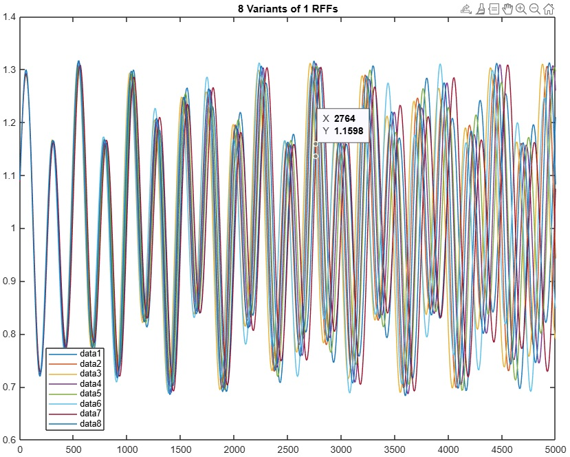
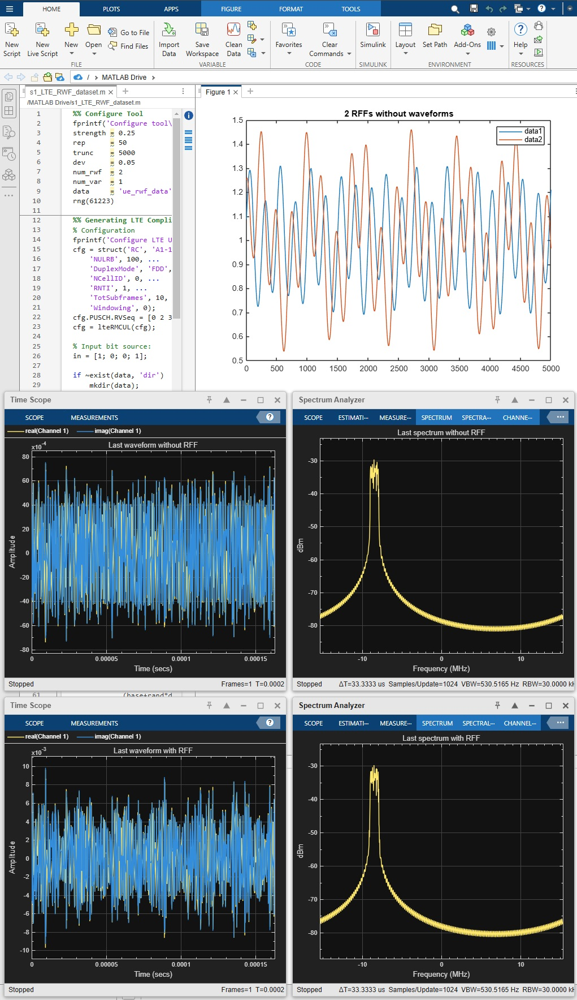
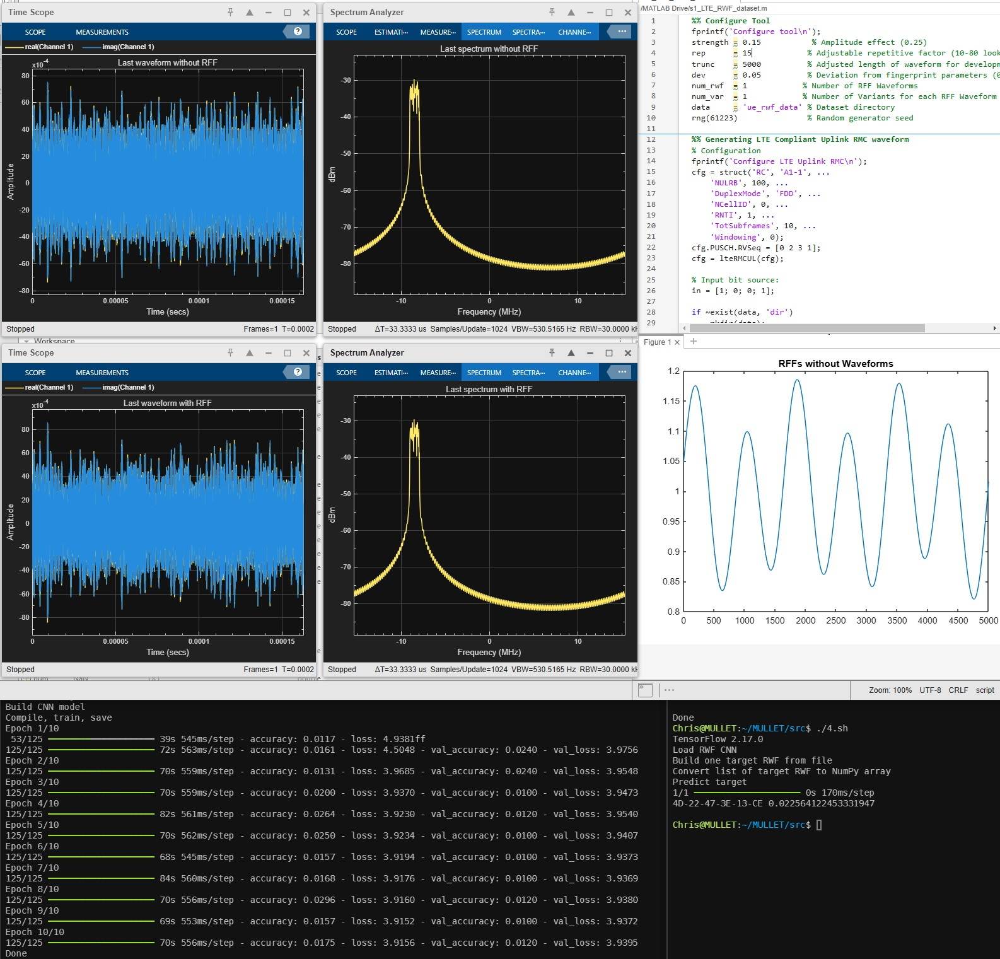
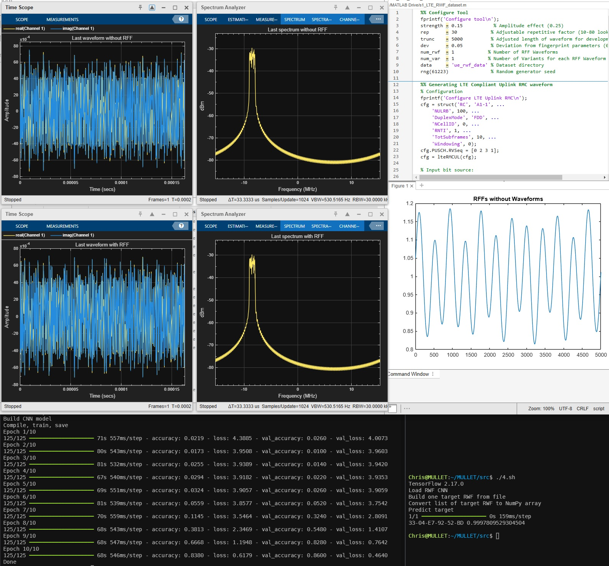

# Machine Learning LTE RF Fingerprinter

## Generation Tools

Steps 1 and 3 use MATLAB to generate LTE waveforms for simulation and test. Steps 2 and 4 use Python to build the neural network, and test a case against it. Python is used so that the ML power and code flexibility of open-sourced TensorFlow can be harnessed

### s1_LTE_RWF_dataset.m
Simulated RF Fingerprints (RFF) are generated by random parameters (that are likely unique) of a sine and cosine combination. Their effect on the base Reference Measurement Channel (RMC) waveform generated by LTE ToolBox is then the RFF Waveforms (RWF). They can be illustrated on the MATLAB GUI by uncommenting plot, timescopes and spectrum analyzers with and without the RFFs applied

__Inputs__

Repetitive factor of sine and cosine combination (e.g. 25)  
Strength percentage of RF Fingerprint (e.g. 15)

__Outputs__

*25x15_ue_rwf_data* Dataset directory of different devices given by MAC addresses, each with RWFs in numerically named files  
*25x15_ue_rwf_parms.asc* Dataset's MAC addresses and the associated characteristic parameters for their RWF

### s2_BuildTrainCNN.py
RWFs are applied to build the Convolutional Neural Network (CNN)

__Inputs__  

Repetitive factor of sine and cosine combination (e.g. 25)  
Strength percentage of RF Fingerprint (e.g. 15)

__Outputs__

*25x15_rwf_cnn.keras* CNN built from the RWF dataset by Keras API for TensorFlow  
*25x15_rwf_cnn_norm.asc* Normalization factor of CNN  
*25x15_mac_label_enc.pkl* MAC labels encoded to numerical representation needed by the CNN

### s3_LTE_RWF_test.m
A set of RWF characteristic parameters from *ue_rwf_parms.asc* may be chosen for variables A, B, C, D, J and K and passed into the MATLAB script. Then this step will generate a target variant RWF with marginal deviations. Take note of the UE's associated MAC address, but observe that NO definite MAC address will be passed into the next step (just the label encoding of all MAC addresses)

__Inputs__

Repetitive factor of sine and cosine combination (e.g. 25)  
Strength percentage of RF Fingerprint (e.g. 15)  
Parameters of test RF Fingerprint (use format similar to *ue_rwf_parms.asc*)

__Outputs__

*25x15_target_rwf.asc* Target RWF that may differ slightly from one in the RWF CNN

### s4_MatchUEbyRWF.py
Model predicts the target RWF, decodes its associated label and finds the corresponding probability

__Inputs__

Repetitive factor of sine and cosine combination (e.g. 25)  
Strength percentage of RF Fingerprint (e.g. 15)

__Outputs__

Returns the MAC address of the UE that most closely matches its RWF to the test target and the confidence of its answer

## Experimentation

Eight variants by 5% of one RF Fingerprint



Two different RFFs. Waveform with and without an applied RFF. Their corresponding Spectrum Analyzers still match



Repetitive 15, Strength 15% results in confidence of 2% in the incorrectly guessed UE match



Repetitive 30, Strength 20% results in confidence of 90% in the correctly guessed UE match


Repetitive 30, Strength 15% results in confidence of 99% in the correctly guessed UE match



all.sh result
```
               repetition
                 10    15    20    25    30    35
          .10   0.33x 0.02x 0.04x 0.03x 0.02x 0.02x

          .15   0.02x 0.02x 0.02x 0.02x 0.57  0.09x
strength
          .20   0.02x 0.22x 0.59  0.99  0.99  0.02x

          .25   0.99  0.99  0.99  0.95  0.12x 0.99

          .30   0.99  0.99  0.99  0.99  0.99  0.99

          .35   0.70  0.99  0.99  0.99  0.15x 0.02x
```

## Notes
  
Numbered scripts may be used to invoke steps  
`./1.sh 25 15`  
`./2.sh 25 15`  
`./3.sh 25 15 1.3e-02 1.5e-02 5.6e-03 1.3e-02 1.4e-01 4.6e-02`  
`./4.sh 25 15`

Nested loops that test a range of repetitive factors by a range of strengths  
`./all.sh`

To run in the background without terminating if logging out  
`nohup ./all.sh > 20241108_0221_all.log &`

And viewing that log as it is generated  
`tail -fn+0 20241108_0221_all.log`

To clear all generated files that Git does not control, including dataset or .keras  
`git clean -fdx`

Example on how to restore current baseline of edited file  
`git restore s1_LTE_RWF_dataset.m`

How to restore current baseline of all controlled code  
`git restore :/`

Truncating is necessary due to limits of CPU and memory

Ultimately, this kind of CNN ML can be extended to any wireless platform. LTE was only applied here to demonstrate the principle of RF Fingerprint recognition

## To Do

Restore applicable impairments

Can eventually test with two hardware SDRs